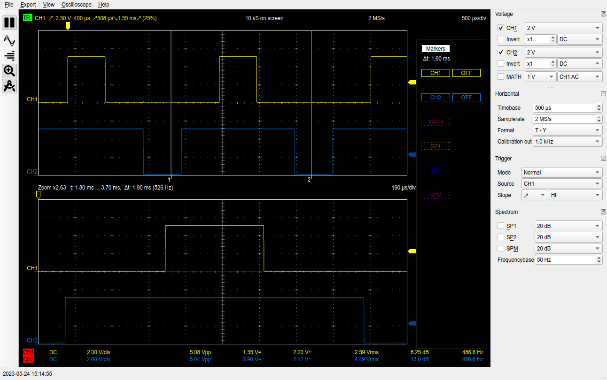
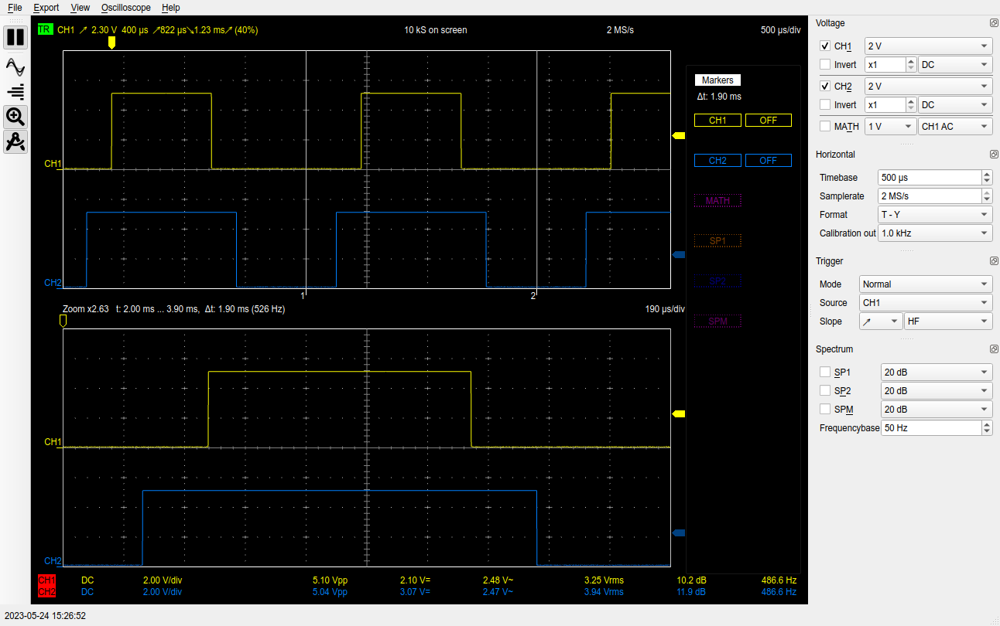
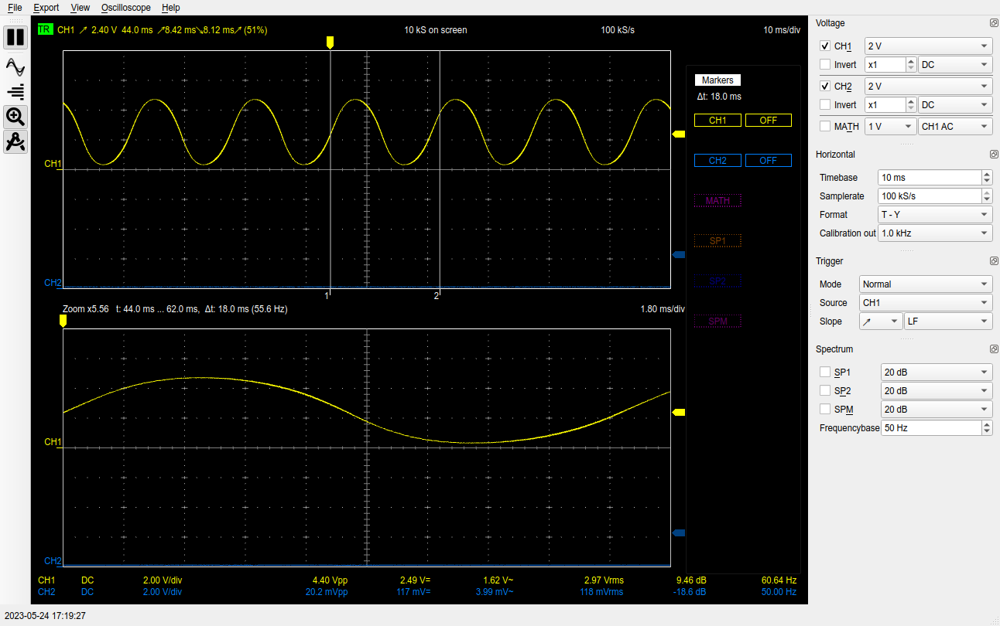
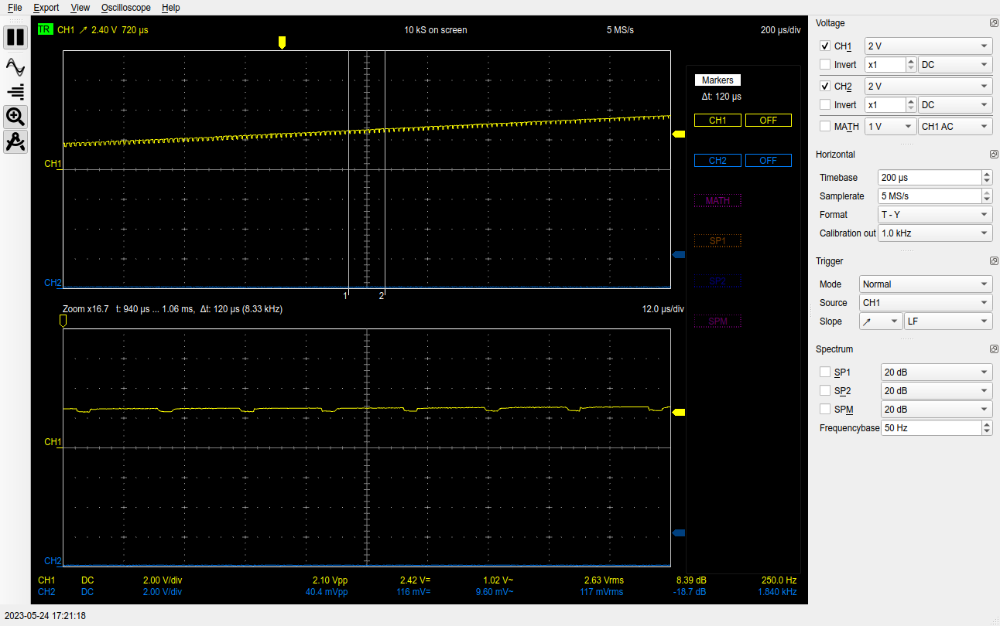
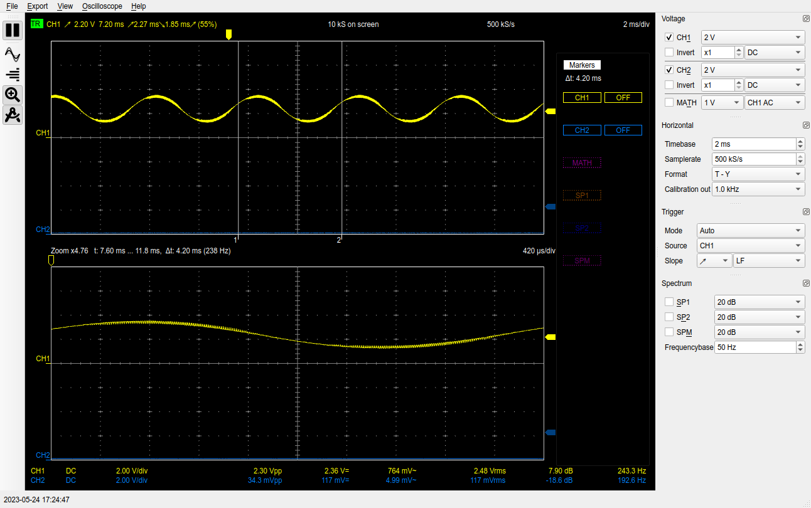

<!--
Syntax for GitHub markdown
https://docs.github.com/en/get-started/writing-on-github/getting-started-with-writing-and-formatting-on-github/basic-writing-and-formatting-syntax
-->

# Sine Wave Generation on Arduino

## Can You Generate Sine Waves with Arduino?

The short answer is no, but the longer answer is, kind of with the
addition of passive components. Arduino can only output digital
signals, high and low, and not analog signals required for a sine
wave. The way
[analogWrite()](https://cdn.arduino.cc/reference/en/language/functions/analog-io/analogwrite/)
works is to generate a PWM (Pulse Width Modulation) digital
signal. The value given to the call determines the duty cycle, the
amount of time the signal is high within the wave cycle.

Adding a capacitor to the output of the PWM pin, will smooth the
signal. While the signal is high, it will charge the capacitor, when
it is low, the capacitor will discharge. The higher the capacitor, the
smoother the resultant wave, however, the amplitude of the wave will
be reduced.

## The Shortfalls of `analogWrite()`

Here is a screen capture from a USB oscilloscope testing a duty
cycle of 10% and 90% on pins D5 and D6 respectively.

### D5: 10%, D6: 90% (Timer0)


Arduino Uno pins D5 and D6 make use of the Timer0 Timer/Counter for
the purposes of PWM/`analogWrite()`. This is the same timer the
`delay()` and `millis()` functions use.  The IDE sets the prescaler
factor for Timer0 to 64 for those functions. The frequency of the
8-bit Timer0 on a 16 MHz clock with a prescaler of 64 is
16 MHz / (64 * 2^8) = 977 Hz. The documentation for `analogWrite()`
claims 980 Hz, but I suspect they are just rounding up.

In this image, you can see the beginning of the duty cycles are aligned
between both outputs. This implies they are using Fast-PWM Mode. In the next
images, however, you can see the centers of the duty cycles are aligned.

### D9: 25%, D10: 75% (Timer1)


### D11: 40%, D3: 60% (Timer2)


`analogWrite()` is using Phase-Correct PWM mode for Timer1 and
Timer2. Timer1 is a 16-bit timer, however, it looks like it is
limiting the timer to just 8 bits. In Phase-Correct PWM mode, the
counters count up and then back down, thus approximately halving the
frequency of the PWM signals. This is why the documentation claims the
resultant frequency on pins D9, D10, D11, and D3 is 490 Hz.

In order to produce a sine wave, better control over the output pins than
`analogWrite()` provides.

## Sine Wave Algorithm

In order to output a sine wave at a controlled frequency, then the
duty cycle of the PWM must be changed for each period. This can be
done with hardware interrupts. Further, since code in interrupts
should be fast, I pre-compute all possible values of the sine wave. My
code includes pre-computed values with 256, 512, and 1024 sample
sizes. These values are not floating point numbers between -1 an 1,
instead they are the values for the comparison register that
will be used to control the output.

In Fast-PWM mode, the output pin associated with a comparison register
is set high if the corresponding timer is less than the comparison
register, then set to low when the timer reaches the comparison
register value. So this algorithm simply changes the comparison
register value at each overflow hardware interrupt (when the timer
overflows and goes back to zero).

The resultant sine wave frequency is basically:
```
F_CPU / (<Prescaling Factor> * 2^<Timer Size> * <Sample Count>)
```

So for example, if we use 512 samples (which is a full sine wave), and
a pre-scaling factor of 8 on Timer2 (8-bit timer), then the sine wave
frequency would be:
```
16 MHz / (8 * 2^8 * 512) = 16 MHz / 1048576 = 15.25 Hz
```

### Sine Wave Frequencies with 8-bit Timer for 256/512/1024 Samples
```
              Frequency at Sample Count  
 Prescaler:    [256]     [512]     [1024]
      1      244.14 Hz 122.07 Hz  61.03 Hz
      8       30.52 Hz  15.25 Hz   7.63 Hz
     32        7.63 Hz   3.81 Hz   1.91 Hz
     64        3.81 Hz   1.91 Hz   0.95 Hz
    128        1.91 Hz   0.95 Hz   0.48 Hz
    256        0.95 Hz   0.48 Hz   0.24 Hz
   1024        0.24 Hz   0.12 Hz   0.06 Hz
```

I ran the code using a 47µF capacitor between the output pin (11) and
ground to smooth the signal to demonstrate the sine wave output on the
oscilloscope. Larger capacitors will create a smoother sine wave, but
with a smaller amplitude.

### 61.03 Hz (Prescaler: 1, Sample Count: 1024)


### 61.03 Hz (Prescaler: 1, Sample Count: 1024) Zoomed


### 244.14 Hz (Prescaler: 1, Sample Count: 256)


You can see in these images, the theoretical sine wave frequency is not
what the USB oscilloscope shows, but that I probably just a difference
in clocks on the Arduino compared to the oscilloscope.

Also, the sine wave seems to be fuzzy at points. The second image shows
a close up of the sine wave. The frequency of the fuzz is that of the
PWM. I tried to add a resistor to make an
[RC Low-Pass Filter](http://www.learningaboutelectronics.com/Articles/Low-pass-filter-calculator.php) but it didn't seem to make much difference.
